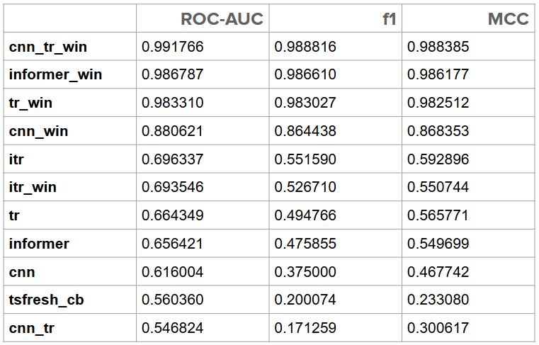

# Поиск паттернов в многомерных временных рядах

Данный проект выполнен в рамках завершения курса "ML.Advanced" от OTUS. 

Цель проекта - разработать модель для поиска в многомерных временных рядах паттернов, предшествующих отказу технологического оборудования. В данном случае использовались показания с датчиков температуры подшипников компрессора за 2 года.

Задача рассматривалась как классификация многомерных временных рядов, и были протестированы алгоритмы:
1. Tsfresf + CatBoost 
2. CNN 
3. Vanilla Transformer 
4. CNN + Transformer
5. Informer
6. iTransformer

Также алгоритмы были протестированы с масштабированием не только всей выборки целиком, но и каждого окна по отдельности, такие модели помечены `win`. Полученные метрики ROC-AUC, f1 и MCC приведены в таблице:

Более подробное описание проекта и выводы приведены в ноутбуке `project.ipynb` и в файле `Project.pdf`, интерактивные графики с результатами работы алгоритмов находятся в папке 'graphs'.

